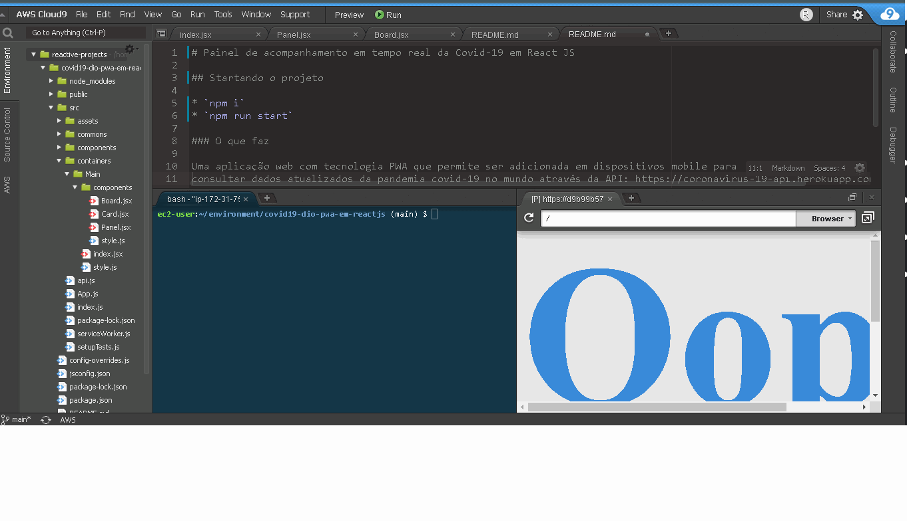
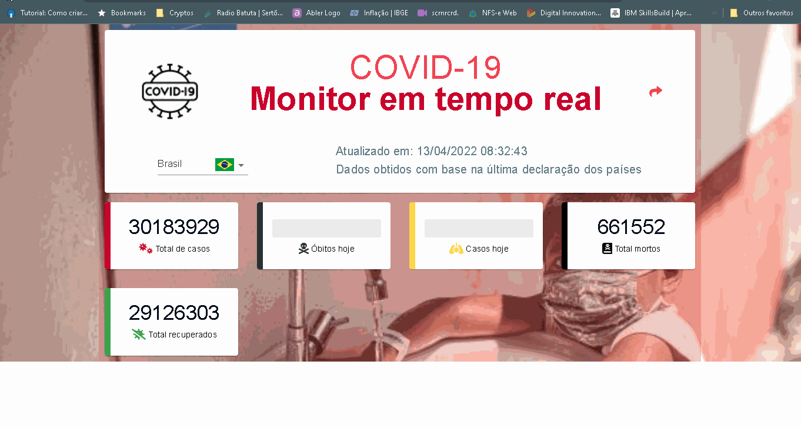

# Painel de acompanhamento em tempo real da Covid-19 em React JS

## Startando o projeto

* `npm i`
* `npm run start`

### O que faz

Uma aplicação web com tecnologia PWA que permite ser adicionada em dispositivos mobile para
consultar dados atualizados da pandemia covid-19 no mundo através da API: https://coronavirus-19-api.herokuapp.com/countries

### Projeto online

**Iniciando servidor**

**Demo**

